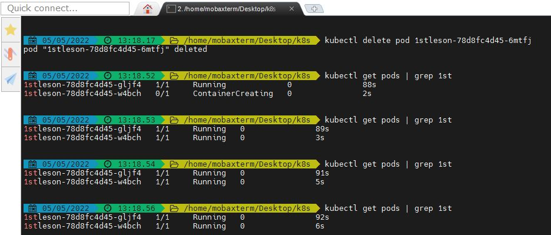

# lesson1
* Create a deployment nginx. Set up two replicas. Remove one of the pods, see what happens.

kubectl create deployment 1stlesson --replicas=2 --image=nginx
deployment.apps/1stlesson created

kubectl get pods | grep 1st
1stlesson-78d8fc4d45-6mtfj   1/1     Running   0               52s
1stlesson-78d8fc4d45-gljf4   1/1     Running   0               52s

kubectl delete pod 1stlesson-78d8fc4d45-6mtfj
pod "1stlesson-78d8fc4d45-6mtfj" deleted

kubectl get pods | grep 1st
1stlesson-78d8fc4d45-gljf4   1/1     Running             0               88s
1stlesson-78d8fc4d45-w4bch   0/1     ContainerCreating   0               2s

kubectl get pods | grep 1st
1stlesson-78d8fc4d45-gljf4   1/1     Running   0               89s
1stlesson-78d8fc4d45-w4bch   1/1     Running   0               3s

kubectl create deployment 1stlesson --replicas=2 --image=nginx --dry-run=client -o json




# Task 1.1
Requirements:
- [Kubectl](https://kubernetes.io/docs/tasks/tools/install-kubectl/)
- [VirtualBox](https://www.virtualbox.org/wiki/Downloads)
- [Minikube](https://minikube.sigs.k8s.io/docs/start/)
## Verify kubectl installation
```bash
kubectl version --client
```
Output, that indicates that everything is working.
```bash
Client Version: version.Info{Major:"1", Minor:"18", GitVersion:"v1.18.0", GitCommit:"9e991415386e4cf155a24b1da15becaa390438d8", GitTreeState:"clean", BuildDate:"2020-03-25T14:58:59Z", GoVersion:"go1.13.8", Compiler:"gc", Platform:"windows/amd64"}
```

## Setup autocomplete for kubectl
```bash
source <(kubectl completion bash)
```

```bash
minikube start --driver=virtualbox
```
## Get information about cluster
```bash
$ kubectl cluster-info
```
Sample output, that indicates that everything is working.
```bash
Kubernetes master is running at https://192.168.99.107:8443
CoreDNS is running at https://192.168.99.107:8443/api/v1/namespaces/kube-system/services/kube-dns:dns/proxy

To further debug and diagnose cluster problems, use 'kubectl cluster-info dump'
```
## get information about available nodes
```bash
$ kubectl get nodes
```
Sample output, that indicates that everything is working.
```bash
NAME       STATUS   ROLES                  AGE     VERSION
minikube   Ready    control-plane,master   9m52s   v1.22.2
```

# Install [Kubernetes Dashboard](https://kubernetes.io/docs/tasks/access-application-cluster/web-ui-dashboard/)
```bash
kubectl apply -f https://raw.githubusercontent.com/kubernetes/dashboard/v2.3.1/aio/deploy/recommended.yaml
```
# Check kubernetes-dashboard ns
```bash
 kubectl get pod -n kubernetes-dashboard
```
Sample output
```bash
NAME                                         READY   STATUS    RESTARTS   AGE
dashboard-metrics-scraper-5594697f48-ng9x6   1/1     Running   0          30m
kubernetes-dashboard-57c9bfc8c8-qjt2s        1/1     Running   0          30m
```
# Install [Metrics Server](https://github.com/kubernetes-sigs/metrics-server#deployment)
```bash
kubectl apply -f https://github.com/kubernetes-sigs/metrics-server/releases/latest/download/components.yaml
```

## Update deployment
```bash
kubectl edit -n kube-system deployment metrics-server
```
```bash
spec:
      containers:
      - args:
        - --cert-dir=/tmp
        - --secure-port=443
        - --kubelet-preferred-address-types=InternalIP,ExternalIP,Hostname
        - --kubelet-insecure-tls
        - --kubelet-use-node-status-port
```

# Connect to Dashboard
## Get token
### Manual

```bash
kubectl describe sa -n kube-system default
# copy token name
kubectl get secrets -n kube-system
kubectl get secrets -n kube-system token_name_from_first_command -o yaml
echo -n "token_from_previous_step" | base64 -d
```
# Same thing in one command
```bash
 kubectl get secrets -n kube-system $(kubectl describe sa -n kube-system default|grep Tokens|awk '{print $2}') -o yaml|grep -E "^[[:space:]]*token:"|awk '{print $2}'|base64 -d
```

### Auto
```bash
export SECRET_NAME=$(kubectl get sa -n kube-system default -o jsonpath='{.secrets[0].name}')
export TOKEN=$(kubectl get secrets -n kube-system $SECRET_NAME -o jsonpath='{.data.token}' | base64 -d)
echo $TOKEN
```

## Connect to Dashboard
```bash
kubectl proxy
```
In browser connect to http://localhost:8001/api/v1/namespaces/kubernetes-dashboard/services/https:kubernetes-dashboard:/proxy/

# Task 1.2
# Kubernetes resources introduction
```bash
kubectl run web --image=nginx:latest
```
- take a look at created resource in cmd "kubectl get pods"
- take a look at created resource in Dashboard
- take a look at created resource in cmd
```bash
minikube ssh
docker container ls
```

## [Specification](https://kubernetes.io/docs/reference/generated/kubernetes-api/v1.18/)
```bash
kubectl explain pods.spec
```
Apply manifests (download from repository)
```bash
kubectl apply -f pod.yaml
kubectl apply -f rs.yaml
```
Look at pod
```bash
kubectl get pod
```
# You can create simple manifest from cmd
```bash
kubectl run web --image=nginx:latest --dry-run=client -o yaml
```
### Homework
* Create a deployment nginx. Set up two replicas. Remove one of the pods, see what happens.
