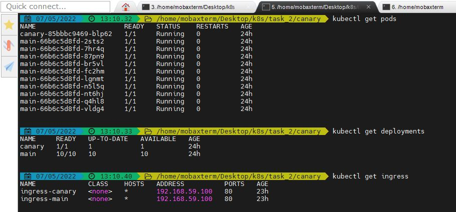
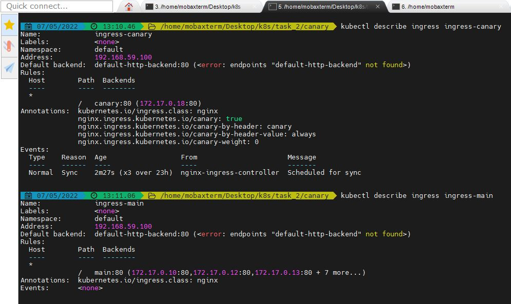

# lesson2
* In Minikube in namespace kube-system, there are many different pods running. Your task is to figure out who creates them, and who makes sure they are running (restores them after deletion).

```bash
 kubectl -n kube-system get pods | grep - | awk {print'$1'}
 kubectl describe pods $(kubectl -n kube-system get pods | grep - | awk {print'$1'}) -n kube-system  | grep "Controlled By"
```


* Implement Canary deployment of an application via Ingress. Traffic to canary deployment should be redirected if you add "canary: always" in the header, otherwise it should go to regular deployment.
Set to redirect a percentage of traffic to canary deployment.

In first screenshot we can see current running pod's daployments and ingress


On this screenshot we can see described ingress for two difirent deployment, with complete configuration of canary deployment. Current canary-weight=0


On this screenshot we can see we can see two difirent services anf those cluster ip addreses.


Here we can see we can see results execution curl command to $(minicube ip) with 80 port. Without headers we go to main application, after adding "canary: always" headers all traffic goes to canary application.


Now we change canary-weight to 10 in ingress-canary.yaml and apply configuration.


And finaly we can see execution curl command to $(minicube ip) at 80 port without headers, with canary application.


# Task 2
### ConfigMap & Secrets
```bash
kubectl create secret generic connection-string --from-literal=DATABASE_URL=postgres://connect --dry-run=client -o yaml > secret.yaml
kubectl create configmap user --from-literal=firstname=firstname --from-literal=lastname=lastname --dry-run=client -o yaml > cm.yaml
kubectl apply -f secret.yaml
kubectl apply -f cm.yaml
kubectl apply -f pod.yaml
```
## Check env in pod
```bash
kubectl exec -it nginx -- bash
printenv
```
### Sample output (find our env)
```bash
Unable to use a TTY - input is not a terminal or the right kind of file
printenv
KUBERNETES_SERVICE_PORT_HTTPS=443
KUBERNETES_SERVICE_PORT=443
DATABASE_URL=postgres://connect
HOSTNAME=nginx
PWD=/
PKG_RELEASE=1~buster
HOME=/root
KUBERNETES_PORT_443_TCP=tcp://10.96.0.1:443
NJS_VERSION=0.6.2
SHLVL=1
KUBERNETES_PORT_443_TCP_PROTO=tcp
KUBERNETES_PORT_443_TCP_ADDR=10.96.0.1
lastname=lastname
KUBERNETES_SERVICE_HOST=10.96.0.1
KUBERNETES_PORT=tcp://10.96.0.1:443
KUBERNETES_PORT_443_TCP_PORT=443
PATH=/usr/local/sbin:/usr/local/bin:/usr/sbin:/usr/bin:/sbin:/bin
firstname=firstname
NGINX_VERSION=1.21.3
_=/usr/bin/printenv
```
### Create deployment with simple application
```bash
kubectl apply -f nginx-configmap.yaml
kubectl apply -f deployment.yaml
```
### Get pod ip address
```bash
kubectl get pods -o wide
NAME                   READY   STATUS    RESTARTS   AGE     IP           NODE       NOMINATED NODE   READINESS GATES
web-5584c6c5c6-6wmdx   1/1     Running   0          4m47s   172.17.0.11   minikube   <none>           <none>
web-5584c6c5c6-l4drg   1/1     Running   0          4m47s   172.17.0.10   minikube   <none>           <none>
web-5584c6c5c6-xn466   1/1     Running   0          4m47s   172.17.0.9    minikube   <none>           <none>
```
* Try connect to pod with curl (curl pod_ip_address). What happens?
* From you PC
* From minikube (minikube ssh)
* From another pod (kubectl exec -it $(kubectl get pod |awk '{print $1}'|grep web-|head -n1) bash)
### Create service (ClusterIP)
The command that can be used to create a manifest template
```bash
kubectl expose deployment/web --type=ClusterIP --dry-run=client -o yaml > service_template.yaml
```
Apply manifest
```bash
kubectl apply -f service_template.yaml
```
Get service CLUSTER-IP
```bash
kubectl get svc
```
### Sample output
```bash
NAME         TYPE        CLUSTER-IP       EXTERNAL-IP   PORT(S)   AGE
kubernetes   ClusterIP   10.96.0.1        <none>        443/TCP   20h
web          ClusterIP   10.100.170.236   <none>        80/TCP    28s
```
* Try connect to service (curl service_ip_address). What happens?

* From you PC
* From minikube (minikube ssh) (run the command several times)
* From another pod (kubectl exec -it $(kubectl get pod |awk '{print $1}'|grep web-|head -n1) bash) (run the command several times)
### NodePort
```bash
kubectl apply -f service-nodeport.yaml
kubectl get service
```
### Sample output
```bash
NAME         TYPE        CLUSTER-IP       EXTERNAL-IP   PORT(S)        AGE
kubernetes   ClusterIP   10.96.0.1        <none>        443/TCP        20h
web          ClusterIP   10.100.170.236   <none>        80/TCP         15m
web-np       NodePort    10.101.147.109   <none>        80:30682/TCP   8s
```
Note how port is specified for a NodePort service
### Checking the availability of the NodePort service type
```bash
minikube ip
curl <minikube_ip>:<nodeport_port>
```
### Headless service
```bash
kubectl apply -f service-headless.yaml
```
### DNS
Connect to any pod
```bash
cat /etc/resolv.conf
```
Compare the IP address of the DNS server in the pod and the DNS service of the Kubernetes cluster.
* Compare headless and clusterip
Inside the pod run nslookup to normal clusterip and headless. Compare the results.
You will need to create pod with dnsutils.
### [Ingress](https://kubernetes.github.io/ingress-nginx/deploy/#minikube)
Enable Ingress controller
```bash
minikube addons enable ingress
```
Let's see what the ingress controller creates for us
```bash
kubectl get pods -n ingress-nginx
kubectl get pod $(kubectl get pod -n ingress-nginx|grep ingress-nginx-controller|awk '{print $1}') -n ingress-nginx -o yaml
```
Create Ingress
```bash
kubectl apply -f ingress.yaml
curl $(minikube ip)
```
### Homework
* In Minikube in namespace kube-system, there are many different pods running. Your task is to figure out who creates them, and who makes sure they are running (restores them after deletion).

* Implement Canary deployment of an application via Ingress. Traffic to canary deployment should be redirected if you add "canary:always" in the header, otherwise it should go to regular deployment.
Set to redirect a percentage of traffic to canary deployment.
