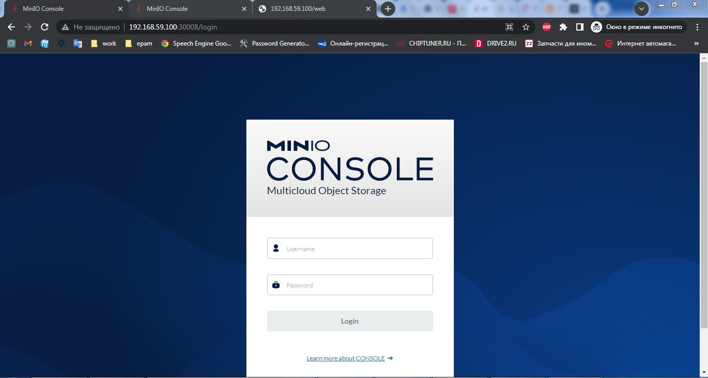
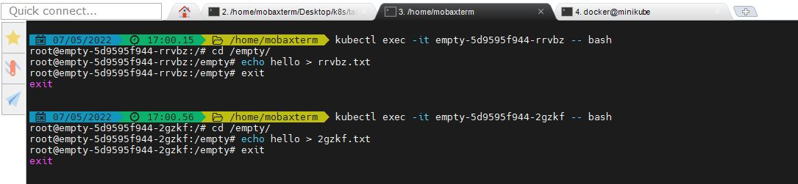
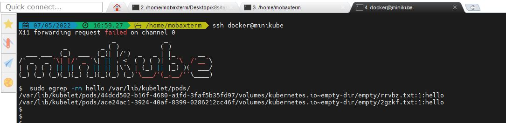
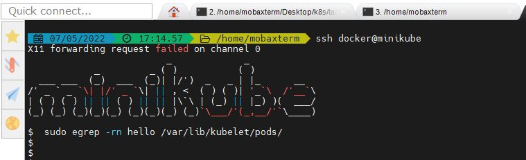

# lesson3
* We published minio "outside" using nodePort. Do the same but using ingress.
```bash
apiVersion: networking.k8s.io/v1
kind: Ingress
metadata:
  name: ingress-minio
  annotations:
    kubernetes.io/ingress.class: "nginx"
  
spec:
  rules:
  - http:
      paths:
      - path: /
        pathType: Prefix
        backend:
          service:
             name: minio-app 
             port: 
                number: 9001
```

* Publish minio via ingress so that minio by ip_minikube and nginx returning hostname (previous job) by path ip_minikube/web are available at the same time.
```bash
cd Desktop/k8s/task_3/ingress/

ll
total 4
-rwxrwx---    1 ▒▒▒▒▒▒▒▒ UsersGrp       579 May  7 15:33 deploy-main.yaml
-rwxrwx---    1 ▒▒▒▒▒▒▒▒ UsersGrp       325 May  7 14:50 ingress-main.yaml
-rwxrwx---    1 ▒▒▒▒▒▒▒▒ UsersGrp       331 May  7 14:47 ingress-minio.yaml
-rwxrwx---    1 ▒▒▒▒▒▒▒▒ UsersGrp       294 Nov  8 20:12 nginx-configmap.yaml
-rwxrwx---    1 ▒▒▒▒▒▒▒▒ UsersGrp       220 May  6 15:10 service-main.yaml

kubectl apply -f ingress-minio.yaml
ingress.networking.k8s.io/ingress-minio created
                                                                                                                                                                  
kubectl apply -f nginx-configmap.yaml
configmap/nginx-configmap created

kubectl apply -f deploy-main.yaml
deployment.apps/main created

kubectl apply -f service-main.yaml
service/main created

kubectl apply -f ingress-main.yaml
ingress.networking.k8s.io/ingress-main created

kubectl get all
NAME                         READY   STATUS    RESTARTS   AGE
pod/main-66b6c5d8fd-ccljt    1/1     Running   0          117m
pod/minio-94fd47554-swgh9    1/1     Running   0          3h11m
pod/minio-state-0            1/1     Running   0          176m

NAME                  TYPE        CLUSTER-IP     EXTERNAL-IP   PORT(S)          AGE
service/kubernetes    ClusterIP   10.96.0.1      <none>        443/TCP          7d18h
service/main          ClusterIP   10.97.31.125   <none>        80/TCP           139m
service/minio-app     NodePort    10.98.188.21   <none>        9001:30008/TCP   3h10m
service/minio-state   ClusterIP   None           <none>        9000/TCP         176m

NAME                    READY   UP-TO-DATE   AVAILABLE   AGE
deployment.apps/main    1/1     1            1           117m
deployment.apps/minio   1/1     1            1           3h11m

NAME                               DESIRED   CURRENT   READY   AGE
replicaset.apps/main-66b6c5d8fd    1         1         1       117m
replicaset.apps/minio-94fd47554    1         1         1       3h11m

NAME                           READY   AGE
statefulset.apps/minio-state   1/1     176m
                                                                                                                                                                 kubectl get ingress
NAME            CLASS    HOSTS   ADDRESS          PORTS   AGE
ingress-main    <none>   *       192.168.59.100   80      160m
ingress-minio   <none>   *       192.168.59.100   80      163m
```



* Create deploy with emptyDir save data to mountPoint emptyDir, delete pods, check data.
```bash
cd ../emptydir/
                                                                                                                              
kubectl apply -f deploy-empty.yaml
deployment.apps/empty created

kubectl get all | grep empty
NAME                         READY   STATUS              RESTARTS   AGE
pod/empty-5d9595f944-2gzkf   0/1     ContainerCreating   0          4s
pod/empty-5d9595f944-rrvbz   0/1     ContainerCreating   0          4s

NAME                    READY   UP-TO-DATE   AVAILABLE   AGE
deployment.apps/empty   0/2     2            0           4s

NAME                               DESIRED   CURRENT   READY   AGE
replicaset.apps/empty-5d9595f944   2         2         0       4s

kubectl get pods | grep empty |  awk {print'$1'}
empty-5d9595f944-2gzkf
empty-5d9595f944-rrvbz

kubectl exec -it empty-5d9595f944-rrvbz -- bash
root@empty-5d9595f944-rrvbz:/# cd /empty/
root@empty-5d9595f944-rrvbz:/empty# echo hello > rrvbz.txt
root@empty-5d9595f944-rrvbz:/empty# exit
exit

kubectl exec -it empty-5d9595f944-2gzkf -- bash
root@empty-5d9595f944-2gzkf:/# cd /empty/
root@empty-5d9595f944-2gzkf:/empty# echo hello > 2gzkf.txt
root@empty-5d9595f944-2gzkf:/empty# exit
exit

ssh docker@minikube
X11 forwarding request failed on channel 0
                         _             _
            _         _ ( )           ( )
  ___ ___  (_)  ___  (_)| |/')  _   _ | |_      __
/' _ ` _ `\| |/' _ `\| || , <  ( ) ( )| '_`\  /'__`\
| ( ) ( ) || || ( ) || || |\`\ | (_) || |_) )(  ___/
(_) (_) (_)(_)(_) (_)(_)(_) (_)`\___/'(_,__/'`\____)

$  sudo egrep -rn hello /var/lib/kubelet/pods/
/var/lib/kubelet/pods/44dcd502-b16f-4680-a1fd-3faf5b35fd97/volumes/kubernetes.io~empty-dir/empty/rrvbz.txt:1:hello
/var/lib/kubelet/pods/ace24ac1-3924-40af-8399-0286212cc46f/volumes/kubernetes.io~empty-dir/empty/2gzkf.txt:1:hello

kubectl delete pod $(kubectl get pods | grep empty | awk {'print$1'})
pod "empty-5d9595f944-2gzkf" deleted
pod "empty-5d9595f944-rrvbz" deleted

ssh docker@minikube
X11 forwarding request failed on channel 0
                         _             _
            _         _ ( )           ( )
  ___ ___  (_)  ___  (_)| |/')  _   _ | |_      __
/' _ ` _ `\| |/' _ `\| || , <  ( ) ( )| '_`\  /'__`\
| ( ) ( ) || || ( ) || || |\`\ | (_) || |_) )(  ___/
(_) (_) (_)(_)(_) (_)(_)(_) (_)`\___/'(_,__/'`\____)

$  sudo egrep -rn hello /var/lib/kubelet/pods/
$
```



* Optional. Raise an nfs share on a remote machine. Create a pv using this share, create a pvc for it, create a deployment. Save data to the share, delete the deployment, delete the pv/pvc, check that the data is safe.
# Task 3
### [Read more about CSI](https://habr.com/ru/company/flant/blog/424211/)
### Create pv in kubernetes
```bash
kubectl apply -f pv.yaml
```
### Check our pv
```bash
kubectl get pv
```
### Sample output
```bash
NAME                  CAPACITY   ACCESS MODES   RECLAIM POLICY   STATUS      CLAIM   STORAGECLASS   REASON   AGE
minio-deployment-pv   5Gi        RWO            Retain           Available                                   5s
```
### Create pvc
```bash
kubectl apply -f pvc.yaml
```
### Check our output in pv 
```bash
kubectl get pv
NAME                  CAPACITY   ACCESS MODES   RECLAIM POLICY   STATUS   CLAIM                            STORAGECLASS   REASON   AGE
minio-deployment-pv   5Gi        RWO            Retain           Bound    default/minio-deployment-claim                           94s
```
Output is change. PV get status bound.
### Check pvc
```bash
kubectl get pvc
NAME                     STATUS   VOLUME                CAPACITY   ACCESS MODES   STORAGECLASS   AGE
minio-deployment-claim   Bound    minio-deployment-pv   5Gi        RWO                           79s
```
### Apply deployment minio
```bash
kubectl apply -f deployment.yaml
```
### Apply svc nodeport
```bash
kubectl apply -f minio-nodeport.yaml
```
Open minikup_ip:node_port in you browser
### Apply statefulset
```bash
kubectl apply -f statefulset.yaml
```
### Check pod and statefulset
```bash
kubectl get pod
kubectl get sts
```

### Homework
* We published minio "outside" using nodePort. Do the same but using ingress.
* Publish minio via ingress so that minio by ip_minikube and nginx returning hostname (previous job) by path ip_minikube/web are available at the same time.
* Create deploy with emptyDir save data to mountPoint emptyDir, delete pods, check data.
* Optional. Raise an nfs share on a remote machine. Create a pv using this share, create a pvc for it, create a deployment. Save data to the share, delete the deployment, delete the pv/pvc, check that the data is safe.