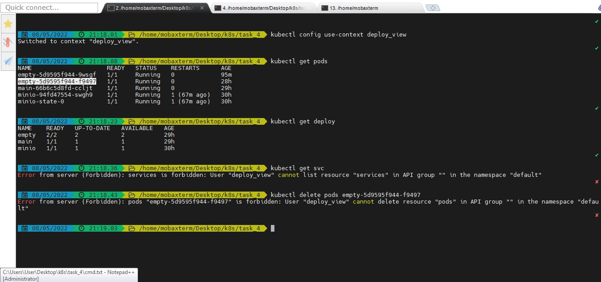
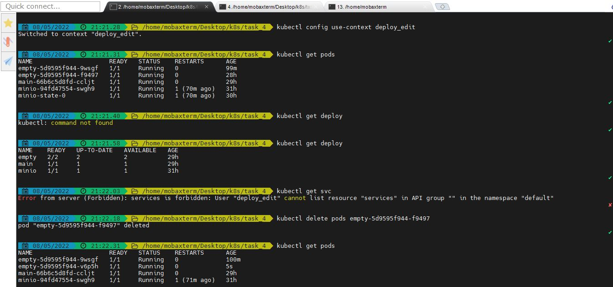
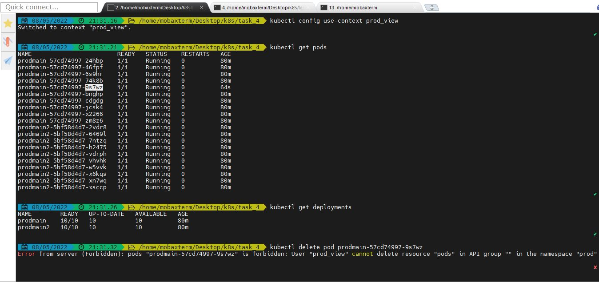
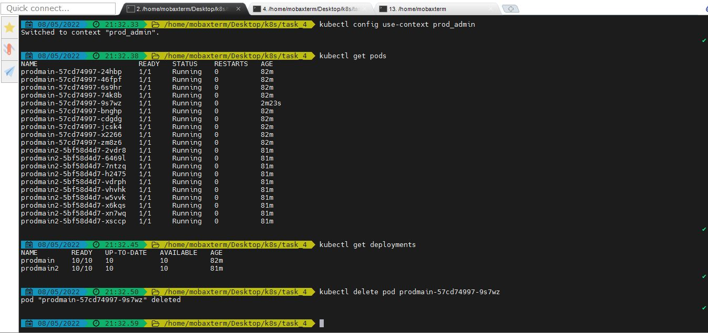
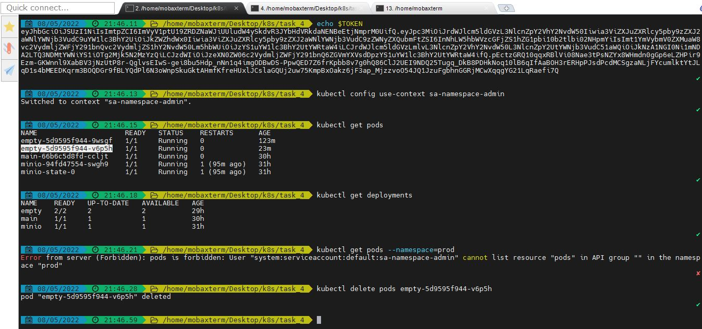
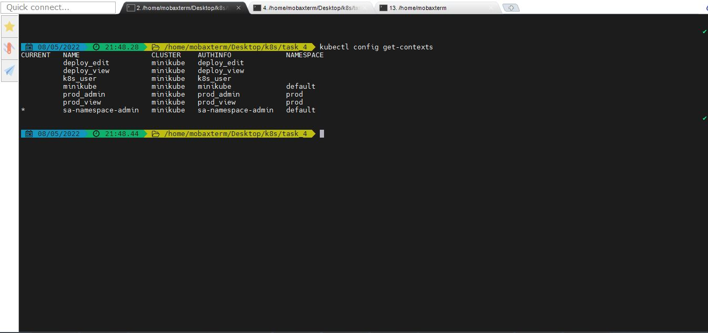

# lesson 4
* Create users deploy_view and deploy_edit. Give the user deploy_view rights only to view deployments, pods. Give the user deploy_edit full rights to the objects deployments, pods.
```bash
kubectl config use-context minikube

openssl genrsa -out deploy_view.key 2048
openssl req -new -key deploy_view.key -out deploy_view.csr -subj "/CN=deploy_view"
openssl x509 -req -in deploy_view.csr -CA /drives/C/Users/User/.minikube/ca.crt -CAkey /drives/C/Users/User/.minikube/ca.key -CAcreateserial -out deploy_view.crt -days 500
kubectl config set-credentials deploy_view --client-certificate=deploy_view.crt --client-key=deploy_view.key
kubectl config set-context deploy_view --cluster=minikube --user=deploy_view

openssl genrsa -out deploy_edit.key 2048
openssl req -new -key deploy_edit.key -out deploy_edit.csr -subj "/CN=deploy_edit"
openssl x509 -req -in deploy_edit.csr -CA /drives/C/Users/User/.minikube/ca.crt -CAkey /drives/C/Users/User/.minikube/ca.key -CAcreateserial -out deploy_edit.crt -days 500
kubectl config set-credentials deploy_edit --client-certificate=deploy_edit.crt --client-key=deploy_edit.key
kubectl config set-context deploy_edit --cluster=minikube --user=deploy_edit

kubectl create clusterrole deploy_view_rule --verb=get,watch,list --resource=pods,deployments
kubectl create clusterrole deploy_edit_rule --verb=* --resource=pods,deployments
kubectl create rolebinding deploy_view --clusterrole=deploy_view_rule --user=deploy_view
kubectl create rolebinding deploy_edit --clusterrole=deploy_edit_rule --user=deploy_edit
```



* Create namespace prod. Create users prod_admin, prod_view. Give the user prod_admin admin rights on ns prod, give the user prod_view only view rights on namespace prod.
```bash
kubectl config use-context minikube

kubectl create ns prod
openssl genrsa -out prod_admin.key 2048
openssl req -new -key prod_admin.key -out prod_admin.csr -subj "/CN=prod_admin"
openssl x509 -req -in prod_admin.csr -CA /drives/C/Users/User/.minikube/ca.crt -CAkey /drives/C/Users/User/.minikube/ca.key -CAcreateserial -out prod_admin.crt -days 500
kubectl config set-credentials prod_admin --client-certificate=prod_admin.crt --client-key=prod_admin.key
kubectl config set-context prod_admin --cluster=minikube --user=prod_admin --namespace=prod

openssl genrsa -out prod_view.key 2048
openssl req -new -key prod_view.key -out prod_view.csr -subj "/CN=prod_view"
openssl x509 -req -in prod_view.csr -CA /drives/C/Users/User/.minikube/ca.crt -CAkey /drives/C/Users/User/.minikube/ca.key -CAcreateserial -out prod_view.crt -days 500
kubectl config set-credentials prod_view --client-certificate=prod_view.crt --client-key=prod_view.key
kubectl config set-context prod_view --cluster=minikube --user=prod_view --namespace=prod

kubectl create role prod_view_rule --namespace=prod --verb=get,list,watch --resource=*.*
kubectl create role prod_admin_rule --namespace=prod --verb=* --resource=*.*
kubectl create rolebinding prod_view --namespace=prod --role=prod_view_rule --user=prod_view
kubectl create rolebinding prod_admin --namespace=prod --role=prod_admin_rule --user=prod_admin
```


* Create a serviceAccount sa-namespace-admin. Grant full rights to namespace default. Create context, authorize using the created sa, check accesses.
```bash
ubectl config use-context minikube

kubectl create serviceaccount sa-namespace-admin
kubectl create role sa-namespace-admin_rule --namespace=default --verb=* --resource=*.*
kubectl create rolebinding sa-namespace-admin --namespace=default --role=sa-namespace-admin_rule --serviceaccount=default:sa-namespace-admin


kubectl config set-context sa-namespace-admin --cluster=minikube --namespace=default --user=sa-namespace-admin

export TOKEN=$(kubectl get secrets -n default $(kubectl describe sa -n default sa-namespace-admin|grep Tokens|awk '{print $2}') -o yaml|grep -E "^[[:space:]]*token:"|awk '{print $2}'|base64 -d)

echo $TOKEN

kubectl config set-credentials sa-namespace-admin --token=$TOKEN
```


* All generated yaml files locate at ./yaml dir.


# Task 4
### Check what I can do
```bash
kubectl auth can-i create deployments --namespace kube-system
```
### Sample output
```bash
yes
```
### Configure user authentication using x509 certificates
### Create private key
```bash
openssl genrsa -out k8s_user.key 2048
```
### Create a certificate signing request
```bash
openssl req -new -key k8s_user.key \
-out k8s_user.csr \
-subj "/CN=k8s_user"
```
### Sign the CSR in the Kubernetes CA. We have to use the CA certificate and the key, which are usually in /etc/kubernetes/pki. But since we use minikube, the certificates will be on the host machine in ~/.minikube
```bash
openssl x509 -req -in k8s_user.csr \
-CA ~/.minikube/ca.crt \
-CAkey ~/.minikube/ca.key \
-CAcreateserial \
-out k8s_user.crt -days 500
```
### Create user in kubernetes
```bash
kubectl config set-credentials k8s_user \
--client-certificate=k8s_user.crt \
--client-key=k8s_user.key
```
### Set context for user
```bash
kubectl config set-context k8s_user \
--cluster=minikube --user=k8s_user
```
### Edit ~/.kube/config
```bash
Change path
- name: k8s_user
  user:
    client-certificate: C:\Users\Andrey_Trusikhin\educ\k8s_user.crt
    client-key: C:\Users\Andrey_Trusikhin\educ\k8s_user.key
contexts:
- context:
    cluster: minikube
    user: k8s_user
  name: k8s_user
```
### Switch to use new context
```bash
kubectl config use-context k8s_user
```
### Check privileges
```bash
kubectl get node
kubectl get pod
```
### Sample output
```bash
Error from server (Forbidden): pods is forbidden: User "k8s_user" cannot list resource "pods" in API group "" in the namespace "default"
```
### Switch to default(admin) context
```bash
kubectl config use-context minikube
```
### Bind role and clusterrole to the user
```bash
kubectl apply -f binding.yaml
```
### Check output
```bash
kubectl get pod
```
Now we can see pods


### Homework
* Create users deploy_view and deploy_edit. Give the user deploy_view rights only to view deployments, pods. Give the user deploy_edit full rights to the objects deployments, pods.
* Create namespace prod. Create users prod_admin, prod_view. Give the user prod_admin admin rights on ns prod, give the user prod_view only view rights on namespace prod.
* Create a serviceAccount sa-namespace-admin. Grant full rights to namespace default. Create context, authorize using the created sa, check accesses.
